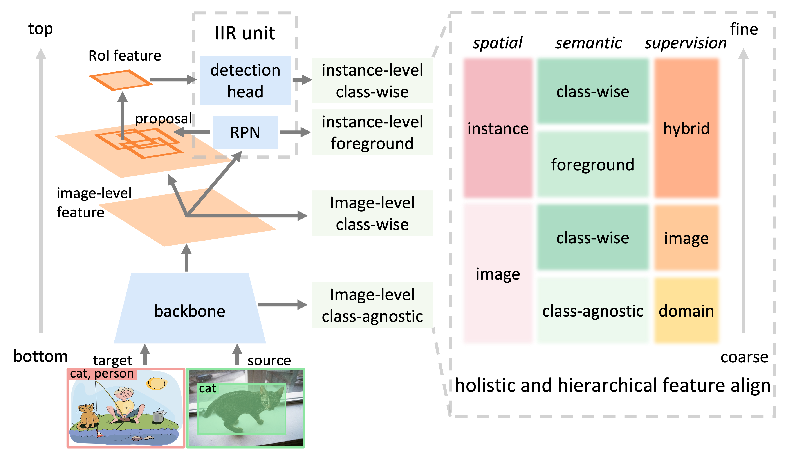

# H<sup>2</sup>FA R-CNN
[](https://paperswithcode.com/sota/weakly-supervised-object-detection-on-2?p=h2fa-r-cnn-holistic-and-hierarchical-feature)
[](https://paperswithcode.com/sota/weakly-supervised-object-detection-on-1?p=h2fa-r-cnn-holistic-and-hierarchical-feature)
[](https://paperswithcode.com/sota/weakly-supervised-object-detection-on-comic2k?p=h2fa-r-cnn-holistic-and-hierarchical-feature)

This branch includes the official PaddleDetection (PaddlePaddle) implementation for our paper:

[H<sup>2</sup>FA R-CNN: Holistic and Hierarchical Feature Alignment for Cross-domain Weakly Supervised Object Detection, CVPR 2022](https://openaccess.thecvf.com/content/CVPR2022/html/Xu_H2FA_R-CNN_Holistic_and_Hierarchical_Feature_Alignment_for_Cross-Domain_Weakly_CVPR_2022_paper.html)

> **Abstract:** *Cross-domain weakly supervised object detection (CDWSOD) aims to adapt the detection model to a novel target domain with easily acquired image-level annotations. How to align the source and target domains is critical to the CDWSOD accuracy. Existing methods usually focus on partial detection components for domain alignment. In contrast, this paper considers that all the detection components are important and proposes a Holistic and Hierarchical Feature Alignment (H<sup>2</sup>FA) R-CNN. H<sup>2</sup>FA R-CNN enforces two image-level alignments for the backbone features, as well as two instance-level alignments for the RPN and detection head. This coarse-to-fine aligning hierarchy is in pace with the detection pipeline, i.e., processing the image-level feature and the instance-level features from bottom to top. Importantly, we devise a novel hybrid supervision method for learning two instance-level alignments. It enables the RPN and detection head to simultaneously receive weak/full supervision from the target/source domains. Combining all these feature alignments, H<sup>2</sup>FA R-CNN effectively mitigates the gap between the source and target domains. Experimental results show that H<sup>2</sup>FA R-CNN significantly improves cross-domain object detection accuracy and sets new state of the art on popular benchmarks.*

<div align="center">
  
</div>

## Installation
### Requirements
* Linux with CUDA ≥ 11.2, cuDNN ≥ 8.1, gcc & g++ ≥ 5.4, and Python ≥ 3.6
* PadddlePaddle ≥ 2.2, following [PaddlePaddle installation instructions](https://www.paddlepaddle.org.cn/install/quick?docurl=/documentation/docs/zh/install/conda/linux-conda_en.html). Note, please check PaddlePaddle version matches that is required by PaddleDetection
* PaddleDetection ≥ 2.4, following [PaddleDetection installation instructions](https://github.com/PaddlePaddle/PaddleDetection/blob/release/2.4/docs/tutorials/INSTALL.md).

### Build H<sup>2</sup>FA R-CNN
```
git clone -b ppdet https://github.com/XuYunqiu/H2FA_R-CNN.git
cd H2FA_RCNN
python setup.py install
```

## Data Preparation
* Download source domain (PASCAL VOC 07 and 12) datasets from [PASCAL VOC](http://host.robots.ox.ac.uk/pascal/VOC/)

* Download target domain (Clipart, Watercolor and Comic) datasets from [cross domain detection](https://github.com/naoto0804/cross-domain-detection/tree/master/datasets)

For a few datasets that H<sup>2</sup>FA R-CNN natively supports, the datasets are assumed to exist in a directory called "dataset/", under the directory where you launch the program. They need to have the following directory structure:
```
dataset
├── cdod/
|   ├── train.txt
|   ├── test.txt
|   ├── label_list.txt
|   └── {clipart,watercolor,comic}/
|       ├── Annotations/
|       ├── ImageSets/
|       └── JPEGImages/
└── voc/
    ├── trainval.txt
    ├── test.txt
    ├── label_list.txt
    └── VOCdevkit/
        └── VOC20{07,12}/
            ├── Annotations/
            ├── ImageSets/
            └── JPEGImages/
```

Note, the size of some target domain images is inconsistent with that provided in their annotations. You may need to resize these images according to the annotations. These images are summarized in this [list](mismatch_anno_list.txt).


## Getting Started
### Training & Evaluation in Command Line

* To train a model on a single GPU, run 
```
python tools/h2fa_rcnn_train.py -c configs/h2fa_rcnn/h2fa_rcnn_r101_1x.yml
```

Note, our `_GradientScalarLayer` is a custom operator implemented using `paddle.autograd.PyLayer` that is not supported in [`paddle.DataParallel`](https://www.paddlepaddle.org.cn/documentation/docs/en/api/paddle/DataParallel_en.html) so far. Thus, we currently do not provide the multi-GPU training in our PaddleDetection implementation.

* To evaluate the trained models, use
```
python tools/eval.py -c configs/h2fa_rcnn/h2fa_rcnn_r101_1x.yml -o weights=output/h2fa_rcnn_r101_1x/model_final
```

## TODO
- [x] Detectron2 implementation ([main branch](https://github.com/XuYunqiu/H2FA_R-CNN/tree/main))
- [x] PaddleDetection implementation (this branch)
- [ ] Make PaddleDetection a third party


## Citation
If you find this project useful for your research, please use the following BibTeX entry.
```BibTeX
@inproceedings{xu2022h2fa,
  title={{H$^2$FA R-CNN}: Holistic and Hierarchical Feature Alignment for Cross-domain Weakly Supervised Object Detection},
  author={Xu, Yunqiu and Sun, Yifan and Yang, Zongxin and Miao, Jiaxu and Yang, Yi},
  booktitle={Proceedings of IEEE/CVF Conference on Computer Vision and Pattern Recognition (CVPR)},
  year={2022},
  pages={14329-14339},
}
```

## License
This project is released under the [Apache 2.0 license](LICENSE).

## Acknowledgement
We build the project based on [Detectron2](https://github.com/facebookresearch/detectron2) and [PaddleDetection](https://github.com/PaddlePaddle/PaddleDetection). Thanks for their contributions.


## Contact
If you have any questions, please drop me an email: imyunqiuxu@gmail.com

